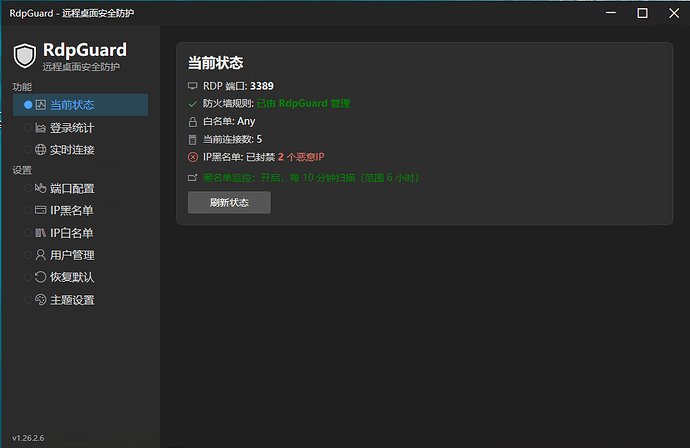
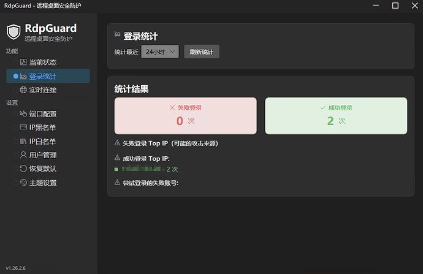
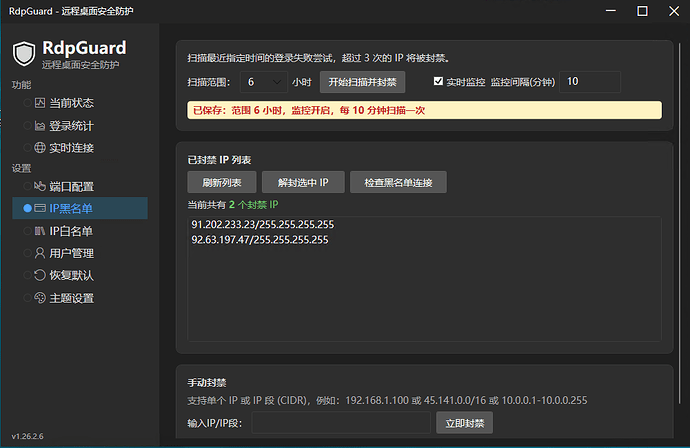

# RdpGuard

轻量级 Windows RDP 安全防护工具。通过日志审计、黑白名单、防火墙规则与端口配置，降低暴力破解与入侵风险。

## 功能概览

- **当前状态监控**：展示 RDP 端口、服务/防火墙状态、白名单、连接数、黑名单数量。
- **登录统计**：基于 Windows Security 事件日志（4624/4625）统计成功/失败登录、Top IP、Top 用户名。
- **实时连接**：展示当前 TCP/UDP 连接，支持仅显示 RDP 连接，黑名单来源自动标记。
- **IP 黑名单**：扫描失败登录并自动封禁（失败 > 3 次），支持手动添加/解封、检测黑名单连接、实时监控定时扫描。
- **IP 白名单**：仅允许白名单 IP 访问 RDP，防误封本机 IP。
- **端口配置**：一键修改 RDP 端口（1024–65535），可选自动重启服务。
- **用户管理**：列出系统用户、重置密码。
- **主题设置**：浅色/深色/跟随系统。
- **托盘与单实例**：关闭最小化到托盘，右键退出；重复启动会激活已有窗口。

## 界面截图







## 运行环境

- Windows 10/11 或 Windows Server
- .NET 8 Desktop Runtime（framework‑dependent 发布）
- 需要管理员权限读取 Security 日志与操作防火墙

## 目录结构

- `Views/`：WPF 页面与窗口
- `ViewModels/`：MVVM 逻辑
- `Services/`：系统/日志/防火墙/白名单/连接等服务
- `Themes/`：主题资源
- `Assets/`：图标与资源

## 构建与运行

在项目根目录执行：

```powershell
dotnet restore
dotnet build -c Release
```

运行（开发调试）：

```powershell
dotnet run
```

## 发布（单文件、framework‑dependent）

项目已配置为 **单文件发布**（不打包运行时，体积更小）：

```powershell
dotnet publish -c Release
```

输出目录：

```
bin\Release\net8.0-windows\win-x64\publish\
```

## 图标

应用图标来自 `Assets/app-icon.ico`，同时用于任务栏与托盘图标。

## 说明

部分功能依赖系统权限：

- 读取安全日志（Event ID 4624/4625）
- 配置防火墙规则
- 修改 RDP 端口
- 重启远程桌面服务

请使用管理员权限运行以获得完整功能。

